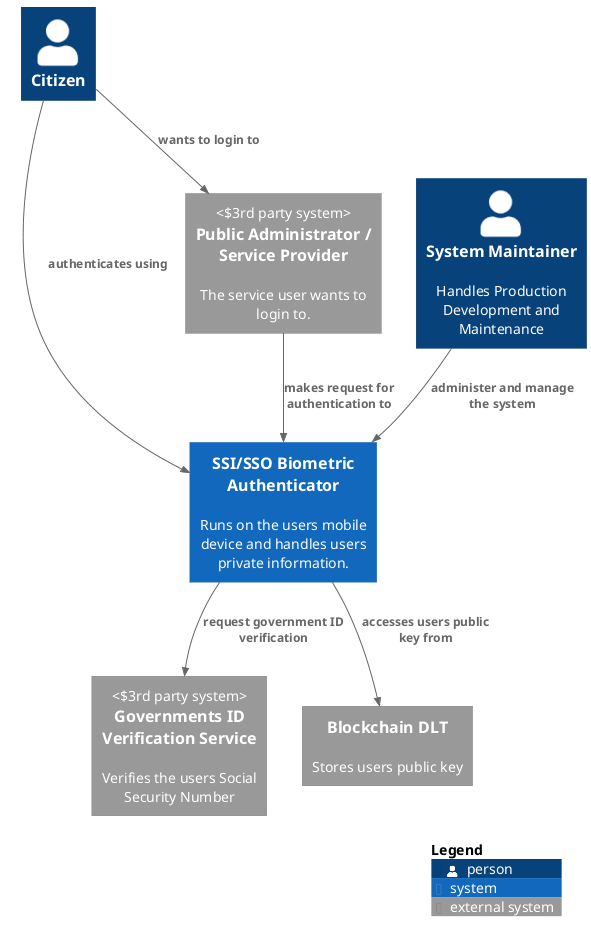
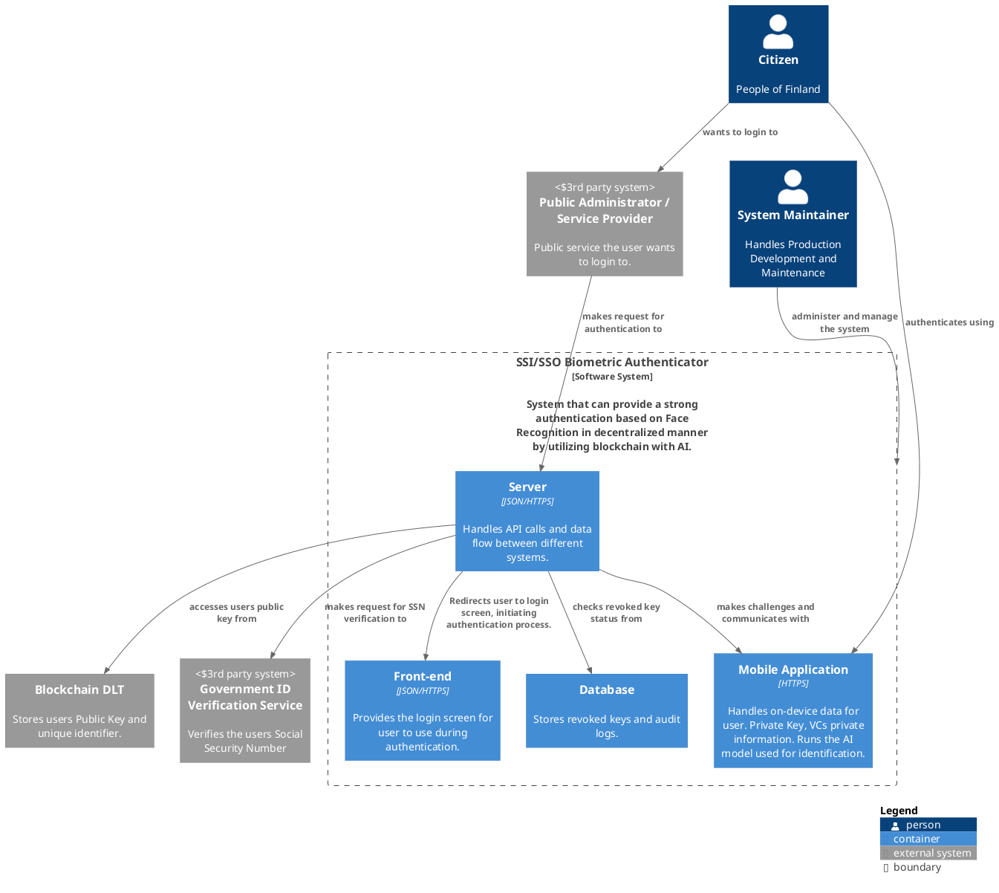
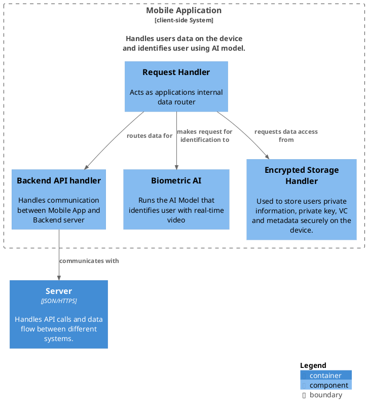

## Architecture project diagrams

To be able to generate the diagrams, you will need the PlantUML https://github.com/plantuml-stdlib/C4-PlantUML

Naturally, you will need plantuml binary.

Apparently there exists a vscode extension that provides preview functionality so you can see what you are doing. 
https://marketplace.visualstudio.com/items?itemName=jebbs.plantuml

### C1 Diagram:

**Context**

### C2 Diagram: 

**Container**

### C3 Diagram:

**Component**

**Mobile Application**

